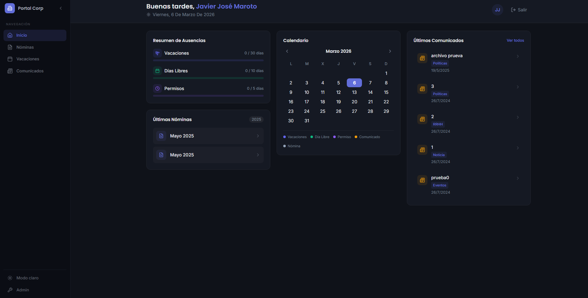
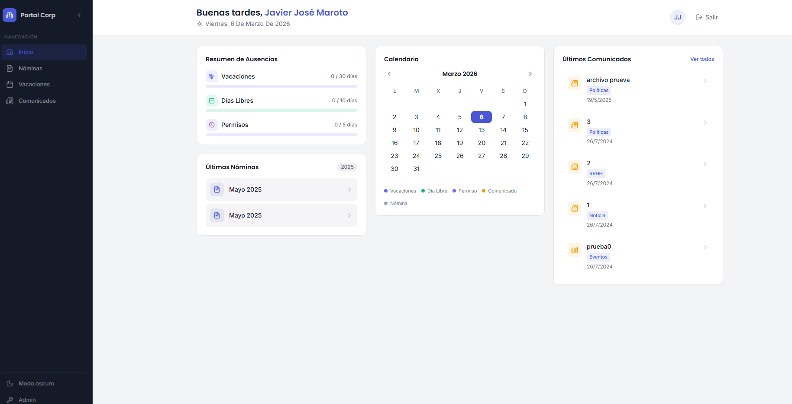
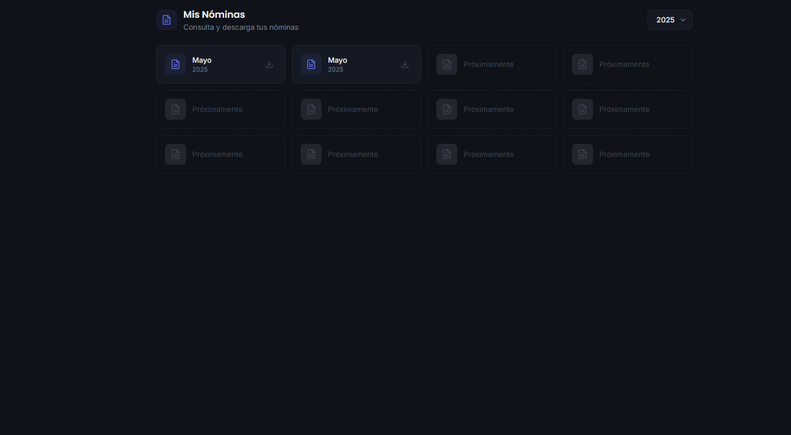
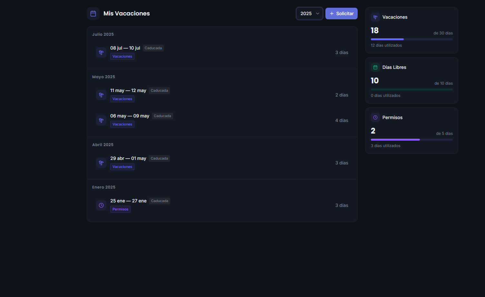
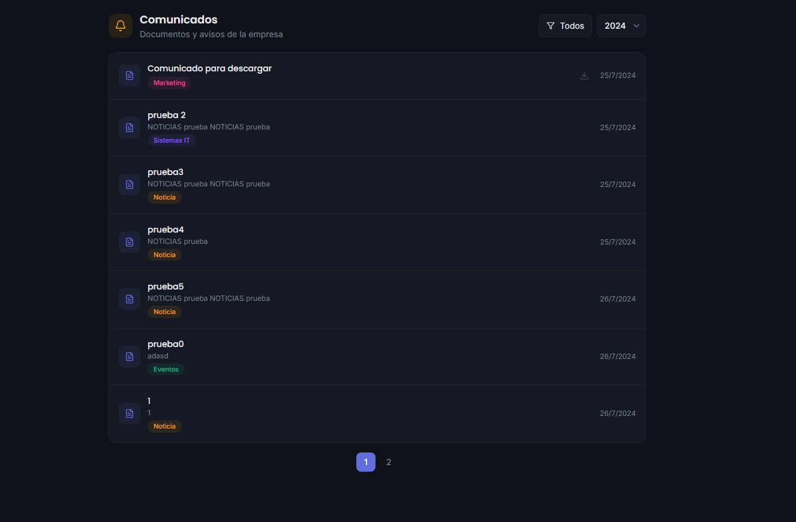

# Portal Corp — Employee Portal

<div align="center">

[](https://python.org)
[](https://djangoproject.com)
[](https://reactjs.org)
[](https://tailwindcss.com)
[](LICENSE)

Full-stack employee management system. Centralized dashboard, payroll management, time-off requests and internal announcements.

[**Live Demo**](https://portal-employes.onrender.com)

</div>

---

## Live Demo

> **Note**: Free Render services spin down after inactivity. First load may take ~30 seconds.

| | URL |
|---|---|
| **Frontend** | [portal-employes.onrender.com](https://portal-employes.onrender.com) |
| **API REST** | [portal-employes-api.onrender.com/api/](https://portal-employes-api.onrender.com/api/) |

### Test Credentials

| Role | User (DNI) | Password |
|---|---|---|
| Admin | `admin` | `Portal2024!` |
| Employee | `12345678Z` | `Demo2024!` |

---

## Screenshots

<div align="center">

### Dark Mode


### Light Mode


<details>
<summary><strong>More screenshots</strong></summary>

#### Payroll


#### Time Off


#### Announcements


</details>

</div>

---

## Features

| Module | Description |
|---|---|
| **Dashboard** | Centralized panel with absence summary, interactive calendar with events, recent payslips and latest announcements |
| **Payroll** | View and download payslips in PDF, organized by month and year with period selector |
| **Time Off** | Request vacation, days off and permits with visual calendar, available days summary and status tracking |
| **Announcements** | Internal announcements by department with filters, pagination and document downloads |
| **Admin Panel** | Staff absence management table with search, type filters and column sorting |
| **Dark Mode** | Light/dark theme toggle with localStorage persistence and automatic system detection |

---

## Architecture

```
┌─────────────┐       ┌─────────────────┐       ┌──────────────┐
│   Browser   │◄─────►│  Render Static  │       │  PostgreSQL  │
│  React SPA  │       │     Site        │       │   (Render)   │
└─────────────┘       └─────────────────┘       └──────▲───────┘
                                                       │
                      ┌─────────────────┐              │
                      │  Render Web     │──────────────┘
                      │  Service        │
                      │  Django + DRF   │
                      │  Gunicorn       │
                      └─────────────────┘
```

- **Frontend**: React SPA deployed as a Static Site on Render, consumes the REST API via Axios with JWT interceptors
- **Backend**: Django REST Framework with Gunicorn, JWT authentication, PDF processing and file management
- **Database**: PostgreSQL on Render (production) / SQLite3 for local development
- **Static files**: Served with WhiteNoise

---

## Tech Stack

### Backend
- **Django 5.0** with Django REST Framework
- **JWT Authentication** (`djangorestframework-simplejwt`) with automatic refresh
- **Database**: SQLite3 (development) / PostgreSQL (production)
- **PDF Processing**: `pdfplumber` + `PyPDF2` for DNI extraction and automatic splitting
- **Gunicorn** as WSGI server with **WhiteNoise** for static files

### Frontend
- **React 18** with React Router 6
- **Tailwind CSS** with design system based on CSS variables (HSL)
- **Radix UI** for accessible components (Dialog, DropdownMenu, Sheet)
- **Lucide React** for icons
- **Framer Motion** for animations
- **Axios** with interceptors for automatic token management
- **Jest + React Testing Library** (43 tests)

---

## Project Structure

```
Portal-Employes/
├── backend/
│   ├── backend/
│   │   ├── settings.py
│   │   ├── urls.py
│   │   └── wsgi.py
│   ├── base/
│   │   ├── models.py            # Profile, PdfFile, Vacacion, Post, PostView
│   │   ├── serializer.py
│   │   ├── admin.py
│   │   ├── api/
│   │   │   ├── urls.py
│   │   │   └── views.py
│   │   └── templates/           # PDF templates for time-off requests
│   ├── requirements.txt
│   └── build.sh                 # Render build script
│
├── frontend/
│   ├── src/
│   │   ├── pages/               # Dashboard, Payroll, TimeOff, Announcements
│   │   ├── components/          # Reusable components (ui/, auth/, vacations/)
│   │   ├── contexts/            # VacationContext, NominasContext, ViewsContext
│   │   ├── hooks/               # useDarkMode
│   │   ├── __tests__/           # Unit tests (Jest + RTL)
│   │   ├── api.js               # Axios with JWT interceptors
│   │   └── index.css            # Design system (CSS variables light/dark)
│   ├── package.json
│   └── tailwind.config.js
│
├── .env.example
└── LICENSE
```

---

## Getting Started

### Local Development

```bash
git clone https://github.com/jv-maroto/Portal-Employes.git
cd Portal-Employes

# Backend
cd backend
pip install -r requirements.txt
export SECRET_KEY="your-secret-key-here"
python manage.py migrate
python manage.py createsuperuser
python manage.py runserver

# Frontend (in another terminal)
cd frontend
npm install
npm start
```

The frontend proxies API requests to `localhost:8000` during development.

### Production (Render.com)

| Service | URL |
|---|---|
| Frontend | [portal-employes.onrender.com](https://portal-employes.onrender.com) |
| API REST | [portal-employes-api.onrender.com/api/](https://portal-employes-api.onrender.com/api/) |
| Django Admin | [portal-employes-api.onrender.com/admin/](https://portal-employes-api.onrender.com/admin/) |

---

## Authentication

1. Login with username/password via `/api/token/`
2. JWT tokens (access + refresh) stored in `localStorage`
3. Axios interceptor adds `Authorization: Bearer <token>` automatically
4. Proactive refresh every 25 minutes
5. 401 responses trigger token refresh or redirect to login

---

## Environment Variables

### Backend (`backend/backend/settings.py`)
| Variable | Description | Default |
|---|---|---|
| `SECRET_KEY` | Django secret key | Required |
| `DEBUG` | Debug mode | `False` |
| `DATABASE_URL` | Database URL | SQLite3 |
| `ALLOWED_HOSTS` | Allowed hostnames | `localhost` |
| `CORS_ALLOWED_ORIGINS` | Allowed CORS origins | `http://localhost:3000` |
| `EMAIL_HOST_USER` | Email for notifications | — |

### Frontend
| Variable | Description | Default |
|---|---|---|
| `REACT_APP_API_URL` | API base URL | `https://portal-employes-api.onrender.com/api/` |

---

## Security

This project has undergone a security review that includes:

- **Externalized credentials**: All sensitive keys (`SECRET_KEY`, SMTP passwords, database credentials) managed via environment variables, never hardcoded
- **Content sanitization**: `DOMPurify` used to prevent XSS in rendered HTML content (announcements)
- **JWT Authentication**: Access tokens expire in 30 minutes, refresh tokens in 1 day, with automatic renewal
- **File validation**: Secure PDF processing in the backend with automatic DNI extraction
- **Protected routes**: All private routes verify authentication before rendering, with automatic redirect to login
- **CORS configured**: Allowed origins explicitly defined in production

> See [PR #3](https://github.com/jv-maroto/Portal-Employes/pull/3) for details on the security fixes applied.

---

## License

This project is licensed under the MIT License. See [LICENSE](LICENSE) for details.

---

<div align="center">

**Portal Corp** — Employee Management System

Built by [Javier Jose Maroto](https://github.com/jv-maroto)

[](https://github.com/jv-maroto/Portal-Employes)

</div>
